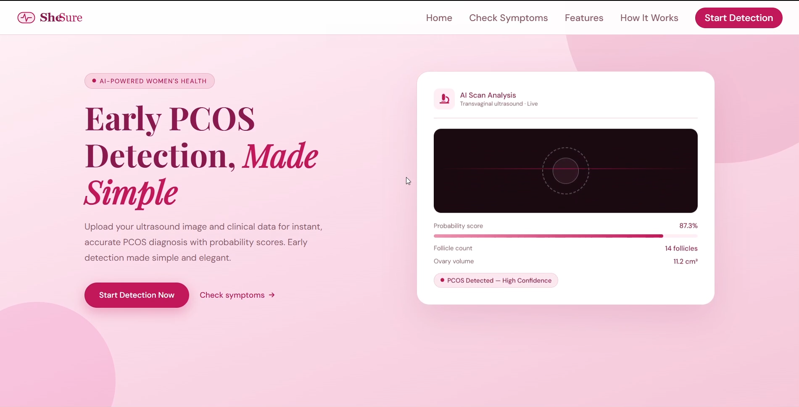
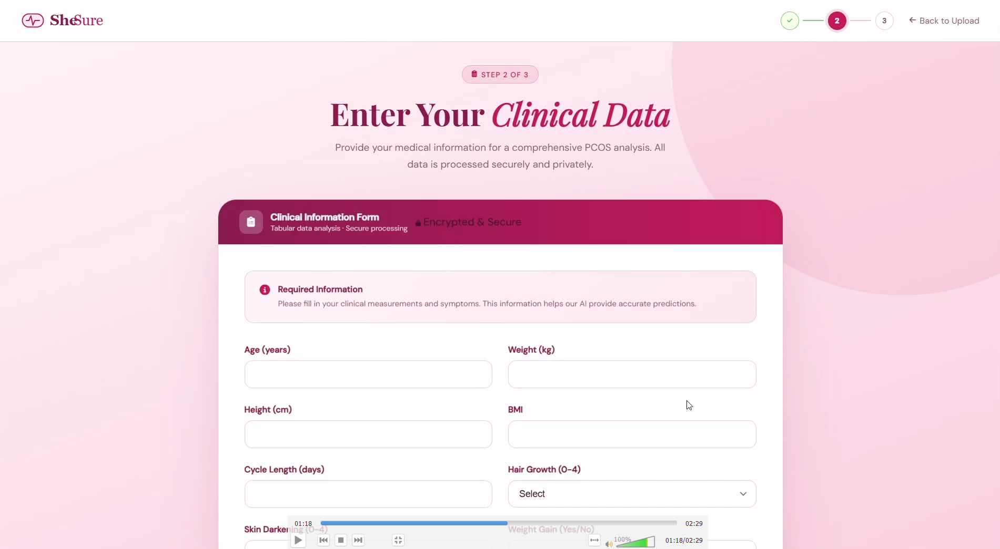
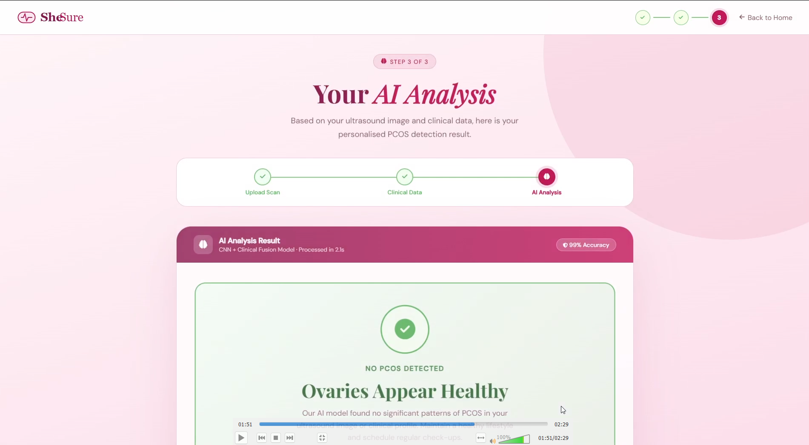

# 🩺 SheSure: AI-Based PCOS Detection System

SheSure is a multimodal Artificial Intelligence system developed for the early detection and screening of Polycystic Ovary Syndrome (PCOS).

The system integrates:

- **Multi-Layer Perceptron (MLP)** for clinical/tabular patient data analysis.
- **Convolutional Neural Network (CNN)** for ultrasound image analysis.

The goal of SheSure is to assist in early diagnosis by analyzing both medical parameters and ultrasound scans, thereby supporting healthcare professionals in identifying potential PCOS cases.

---

## 🚀 Features

- Predicts PCOS risk using clinical patient data.
- Analyzes ovarian ultrasound images using Deep Learning.
- Multimodal architecture combining numerical and image-based diagnosis.
- Interactive web interface for user input.
- Provides rapid screening assistance.

---

## 🏗️ System Architecture

The system follows a multimodal pipeline:

```text
                    User Input
                          |
         ---------------------------------
         |                               |
Clinical/Tabular Data          Ultrasound Image
         |                               |
       MLP Model                     CNN Model
         |                               |
         ---------------------------------
                          |
                Prediction Aggregation
                          |
                   Final PCOS Prediction
```

---

## 📂 Project Structure

```text
SheSure-PCOS-Detection-Using-AI/
│
├── assets/                  # Images, screenshots, diagrams
├── data/                    # Clinical dataset
├── ultrasound_data/         # Ultrasound image dataset
├── models/                  # Saved ML/DL models
├── notebooks/               # Jupyter notebooks
├── scripts/                 # Training and preprocessing scripts
├── templates/               # HTML templates
├── app.py                   # Main Flask application
├── requirements.txt         # Dependencies
└── README.md
```

---

## 🛠️ Technologies Used

### Programming Languages

- Python

### Machine Learning

- Scikit-Learn
- TensorFlow / Keras

### Deep Learning

- CNN (Convolutional Neural Networks)
- MLP (Multi-Layer Perceptron)

### Web Framework

- Flask

### Data Processing

- Pandas
- NumPy

### Visualization

- Matplotlib
- Seaborn

---

## 📸 Screenshots

### Home Page



### Patient Data Input



### Prediction Result



---

## ⚙️ Installation

Clone the repository:

```bash
git clone https://github.com/NejiHyuga55/SheSure-PCOS-Detection-Using-AI.git
```

Move into the project directory:

```bash
cd SheSure-PCOS-Detection-Using-AI
```

Install dependencies:

```bash
pip install -r requirements.txt
```

---

## ▶️ Running the Project

Run the Flask application:

```bash
python app.py
```

Open your browser and visit:

```text
http://127.0.0.1:5000/
```

---

## 📊 Model Information

### MLP Model

Used for classification using tabular medical data such as:

- BMI
- Age
- Hormonal parameters
- Menstrual cycle information
- Clinical symptoms

### CNN Model

Used for analyzing ovarian ultrasound images to identify PCOS-related patterns.

---

## 📈 Future Improvements

- Deploy the application on cloud platforms.
- Integrate explainable AI (XAI) techniques.
- Improve prediction accuracy using larger datasets.
- Add user authentication and patient history.
- Integrate report generation functionality.

---

## 👥 Team

Developed as part of the **Design Thinking and Innovation Course**.

Team Members:

- Hriday Thakur
- Kanishka Jain
- Sahiba Afreen
- Dhanishka Agrawal

---

## 📄 License

This project is licensed under the MIT License.

---

## 🤝 Contributing

Contributions, suggestions, and improvements are welcome.

Please fork the repository and create a pull request.

---

## ⭐ Acknowledgements

- Bennett University
- Design Thinking and Innovation Course
- Open-source Machine Learning community
